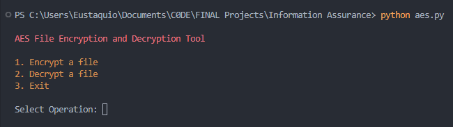

# AES File Encryption and Decryption Tool

This Python script provides a command-line tool for encrypting and decrypting files using the Advanced Encryption Standard (AES) algorithm with a pre-defined encryption key. The tool supports various file types such as text, images, audio, and video.

## CLI



## Features

- Encrypt files using AES-128 encryption with a pre-defined key.
- Decrypt encrypted files using the same key.

## Prerequisites

- Python 3.x
- `pycryptodome` library (install with `pip install pycryptodome`)
- `termcolor` library (install with `pip install termcolor`)

## Usage

- Clone the repository or download the script.
- Navigate to the directory containing the script.
- Run the script using Python:

     ```
     python aes.py
     ```

## License

This project is licensed under the [MIT License](LICENSE).